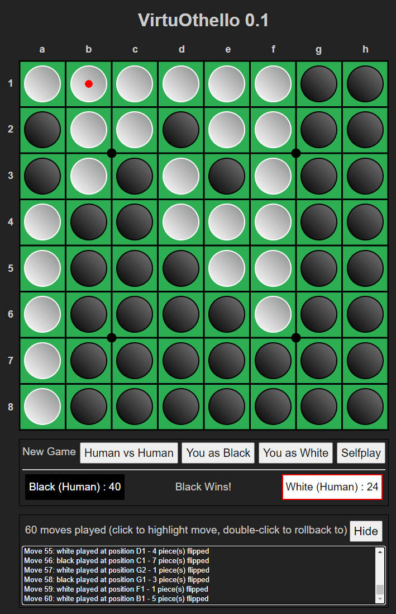

# VirtuOthello
Virtuoso + Othello = VirtuOthello!
This repo contains implementations of the game Othello (a.k.a. "Reversi") using multiple languages and platforms.

The first implementation is being built using TypeScript, for the web browser.
I also plan to implement the game in:
- Dart for Flutter
- C# for Blazor
- TypeScript for React Native
- C# for WinForms or WPF
- TypeScript for React
- TypeScript for Angular

Feel free to browse the source and star the repo if you're an Othello fan!
